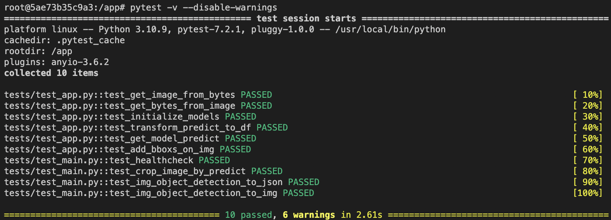

[](https://github.com/Alex-Lekov/yolov8-fastapi)

# YOLOv8-FastAPI:
This repository serves as a template for object detection using YOLOv8 and FastAPI. With YOLOv8, you get a popular real-time object detection model and with FastAPI, you get a modern, fast (high-performance) web framework for building APIs. The project also includes Docker, a platform for easily building, shipping, and running distributed applications.

### Sample
Here's a sample of what you can expect to see with this project:


# What's inside:

- YOLOv8: A popular real-time object detection model
- FastAPI: A modern, fast (high-performance) web framework for building APIs
- Docker: A platform for easily building, shipping, and running distributed applications

</a>

---
# Getting Started

You have two options to start the application: using Docker or locally on your machine.

## Using Docker
Start the application with the following command:
```
docker-compose up
```

## Locally
To start the application locally, follow these steps:

1. Install the required packages:

```
pip install -r requirements.txt
```
2. Start the application:
```
uvicorn main:app --reload --host 0.0.0.0 --port 8001
```  
*Note: You can change the address and port in the file **docker-compose.yaml***

## FAST API Docs url:
http://0.0.0.0:8001/docs#/

    

Ready to start your object detection journey with YOLOv8-FastAPI? 🚀

---
# 🚀 Code Examples
### Example 1: Object Detection to JSON   
The following code demonstrates how to perform object detection and receive the results in JSON format:
```python
import requests

input_image_name = 'test_image.jpg'
api_host = 'http://0.0.0.0:8001/'
type_rq = 'img_object_detection_to_json'

files = {'file': open(input_image_name, 'rb')}

response = requests.post(api_host+type_rq, files=files)

data = response.json()     
print(data)
```
Output:
```
{'detect_objects': [{'name': 'cat', 'confidence': 0.926225245}, {'name': 'dog', 'confidence': 0.9109069705}], 'detect_objects_names': 'cat, dog'}
```

### Example 2: Object Detection to Image    
The following code demonstrates how to perform object detection and receive the results in image format.
```python
import requests
from PIL import Image
from io import BytesIO
import matplotlib.pyplot as plt

input_image_name = 'test_image.jpg'
api_host = 'http://0.0.0.0:8001/'
type_rq = 'img_object_detection_to_img'

files = {'file': open(input_image_name, 'rb')}

response = requests.post(api_host+type_rq, files=files)

img = Image.open(BytesIO(response.content)) 
plt.imshow(img)
```

---

# Overview of the code
* [main.py](./main.py) - Base FastAPI functions  
* [app.py](./app.py) - YoloV8 functions     
* [./models](./models) - YoloV8 models folder    

---
# Test
This repository contains functional tests for a program to ensure the proper operation of the service.

## Getting Started Test
To get started with the testing process, you first need to set up the necessary environment. This can be achieved by either installing the required packages or by running the Docker container.

#### 1. Installing Required Packages:
Run the following command to install the necessary packages:
```
pip install -r requirements.txt
```

Alternatively, you can also run the tests inside a Docker container. To do so, follow these steps:
Start the Docker container:
```
docker-compose up
```
Find the container ID:
```
docker ps
```
Connect inside the container:
```
docker exec -it {CONTAINER_ID}
```

#### 2. Run the tests from the program directory:
Once you have set up the environment, navigate to the program directory and run the tests using the following command:
```
pytest -v --disable-warnings
```

If all tests pass successfully, you will see the following result:     
    

---

# Contact

[Telegram Group](https://t.me/automlalex)